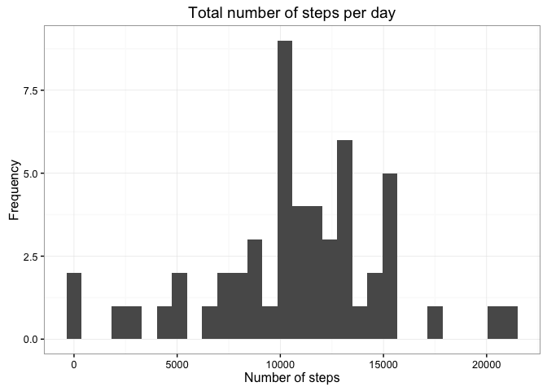
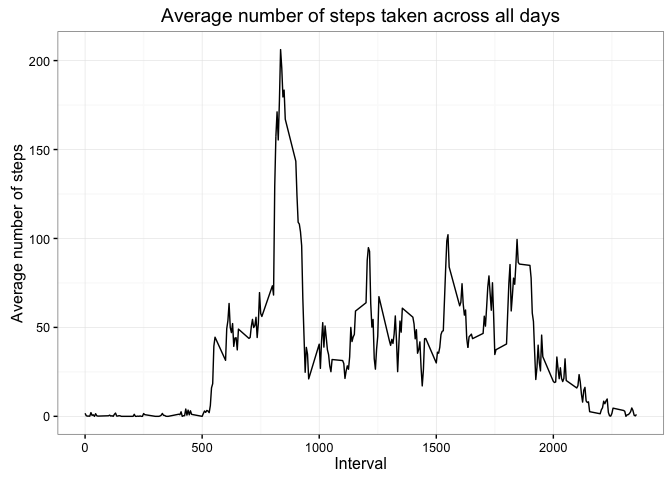
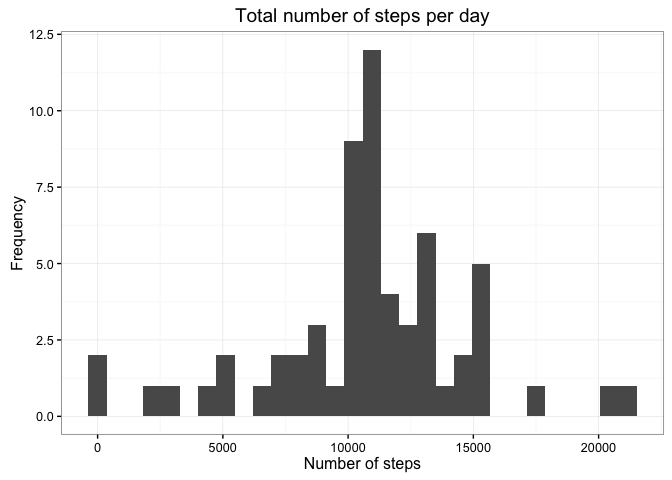
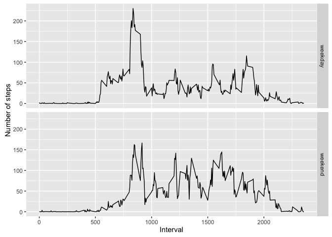

# Reproducible Research: Fitness Tracker Peer Assessment 1

#### Load and preprocess the data:


```r
# Load the data
csv <- read.csv("./data/activity.csv")

# Remove rows with missing values (NA)
activity <- csv[complete.cases(csv), ]

# Print the first 6 rows
head(activity)
```

```
##     steps       date interval
## 289     0 2012-10-02        0
## 290     0 2012-10-02        5
## 291     0 2012-10-02       10
## 292     0 2012-10-02       15
## 293     0 2012-10-02       20
## 294     0 2012-10-02       25
```


#### What is mean total number of steps taken per day?

1. Make a histogram of the total number of steps taken each day.


```r
# Load the ggplot2 and dplyr packages
library(ggplot2)
library(dplyr)

by_day <- group_by(activity, date)
steps_per_day <- summarise(by_day, total = sum(steps))

ggplot(steps_per_day, aes(total)) +
  geom_histogram() +
  ggtitle("Total number of steps per day") +
  xlab("Number of steps") +
  ylab("Frequency") +
  theme_bw()
```

<!-- -->

2. Calculate and report the mean and median total number of steps taken per day.


```r
mean(steps_per_day$total)
```

```
## [1] 10766.19
```

```r
median(steps_per_day$total)
```

```
## [1] 10765
```

Hence, the mean is 10766.19 steps and the median is 10765 steps.


#### What is the average daily activity pattern?

1. Make a time series plot (i.e. type = "l") of the 5-minute interval (x-axis) and the average number of steps taken, averaged across all days (y-axis)


```r
steps_per_interval <- aggregate(steps ~ interval, activity, mean)

ggplot(steps_per_interval, aes(interval, steps)) +
  geom_line() +
  theme_bw() +
  ggtitle("Average number of steps taken across all days") +
  xlab("Interval") +
  ylab("Average number of steps")
```

<!-- -->

2. Which 5-minute interval, on average across all the days in the dataset, contains the maximum number of steps?


```r
index <- which.max(steps_per_interval$steps)
steps_per_interval[index, ]
```

```
##     interval    steps
## 104      835 206.1698
```

Therefore, the interval #835 contains the maximum average number of steps (206.1698).


#### Imputing missing values

Note that there are a number of days/intervals where there are missing values (coded as NA). The presence of missing days may introduce bias into some calculations or summaries of the data.

1. Calculate and report the total number of missing values in the dataset (i.e. the total number of rows with NAs).


```r
# Remember that csv is our original dataset with NAs.
head(csv)
```

```
##   steps       date interval
## 1    NA 2012-10-01        0
## 2    NA 2012-10-01        5
## 3    NA 2012-10-01       10
## 4    NA 2012-10-01       15
## 5    NA 2012-10-01       20
## 6    NA 2012-10-01       25
```

```r
# complete.cases(csv) gives us a boolean vector where
# TRUE means there are no misisng values in that row.

# Therefore, sum(complete.cases(csv)) gives us
# the number of rows with no missing values.
sum(complete.cases(csv))
```

```
## [1] 15264
```

```r
# We need the opposite — number of rows with misisng values.
sum(!complete.cases(csv))
```

```
## [1] 2304
```
There are 2304 rows that contain NA values.


2. Devise a strategy for filling in all of the missing values in the dataset. The strategy does not need to be sophisticated. For example, you could use the mean/median for that day, or the mean for that 5-minute interval, etc.


Let's calculate the mean per 5-minute interval.


```r
mean_steps_per_interval <- aggregate(steps ~ interval, csv, mean)
```

3. Create a new dataset that is equal to the original dataset but with the missing data filled in.


```r
imputed <- merge(x = csv, y = mean_steps_per_interval, by = "interval")
imputed$steps <- ifelse(is.na(imputed$steps.x), imputed$steps.y, imputed$steps.x)
imputed <- imputed[c("date", "steps", "interval")]
```

4. Make a histogram of the total number of steps taken each day and Calculate and report the mean and median total number of steps taken per day. Do these values differ from the estimates from the first part of the assignment? What is the impact of imputing missing data on the estimates of the total daily number of steps?


```r
total_steps_per_day <- aggregate(steps ~ date, imputed, sum)
ggplot(total_steps_per_day, aes(steps)) +
  geom_histogram() +
  ggtitle("Total number of steps per day") +
  xlab("Number of steps") +
  ylab("Frequency") +
  theme_bw()
```

```
## `stat_bin()` using `bins = 30`. Pick better value with `binwidth`.
```

<!-- -->

```r
mean(total_steps_per_day$steps)
```

```
## [1] 10766.19
```

```r
median(total_steps_per_day$steps)
```

```
## [1] 10766.19
```

Hence, the mean and the median is 10766.19 steps. Remember that the initial values for the mean and the median were 10766.19 and 10765 steps, respectively. The mean value stayed the same, but the median increased by 1.19 steps.


#### Are there differences in activity patterns between weekdays and weekends?

For this part the weekdays() function may be of some help here. Use the dataset with the filled-in missing values for this part.

1. Create a new factor variable in the dataset with two levels -- "weekday" and "weekend" indicating whether a given date is a weekday or weekend day.


```r
imputed$date <- as.Date(imputed$date)
imputed$day_type <- ifelse(weekdays(imputed$date) %in% c("Saturday", "Sunday"), "weekend", "weekday")
```

2. Make a panel plot containing a time series plot (i.e. type = "l") of the 5-minute interval (x-axis) and the average number of steps taken, averaged across all weekday days or weekend days (y-axis). The plot should look something like the following, which was created using simulated data:


```r
average_steps_per_day_type <- aggregate(steps ~ interval + day_type, imputed, mean)
ggplot(average_steps_per_day_type, aes(interval, steps)) +
  geom_line() +
  xlab("Interval") +
  ylab("Number of steps") +
  facet_grid(day_type ~ .)
```

<!-- -->
