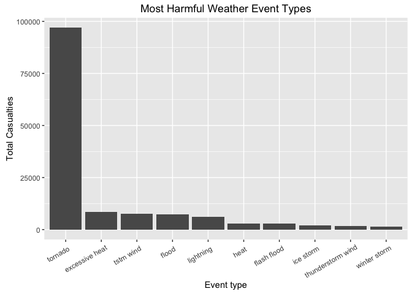
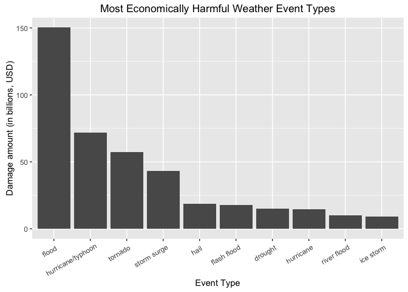

# Most Harmful Weather Event Types

#### Synopsis

The analysis was performed with respect to two factors: population health and economic impact. It can be seen that certain event types, such as tornado and flood are both present in the top 5 in both charts, which means that they are both health and economically detrimental. Both of them are outliers in their respective areas, which might suggest that they should be focus areas for the government in order to minimize losses of both types.

#### Data Processing


```r
# Import the ggplot2 package
library(ggplot2)
library(data.table)

# Load the data
storm.data <- read.csv("./data/storm_data.csv.bz2")

# Make variables and entries more readable
setnames(storm.data, old = c("EVTYPE","INJURIES", "FATALITIES"), new = c("Event.Type", "Injuries", "Fatalities"))
storm.data$Event.Type <- tolower(storm.data$Event.Type)
```


#### Across the United States, which types of events (as indicated in the EVTYPE variable) are most harmful with respect to population health?

Preprocess the data.


```r
# The metric used is the total casualties (sum of injuries + fatalities)
health.harm <- aggregate(Injuries + Fatalities ~ Event.Type, storm.data, sum)
names(health.harm)[2] <- "Total.Casualties"

# Order the matrix by Total.Casualties in decreasing order
health.harm <- health.harm[order(health.harm$Total.Casualties, decreasing = TRUE), ]

# Make health.harm$Event.Type an ordered factor (needed to use with ggplot2)
health.harm$Event.Type <- factor(health.harm$Event.Type, levels = health.harm$Event.Type)

head(health.harm, 10)
```

```
##            Event.Type Total.Casualties
## 758           tornado            96979
## 116    excessive heat             8428
## 779         tstm wind             7461
## 154             flood             7259
## 418         lightning             6046
## 243              heat             3037
## 138       flash flood             2755
## 387         ice storm             2064
## 685 thunderstorm wind             1621
## 888      winter storm             1527
```


##### Results

Plot the bar chart:

```r
ggplot(health.harm[1:10,], aes(factor(Event.Type), Total.Casualties)) +
  geom_bar(stat = "identity") +
  theme(axis.text.x  = element_text(angle=30, hjust = 0.9, vjust = 0.9)) +
  xlab("Event type") + ylab("Total Casualties") + ggtitle("Most Harmful Weather Event Types")
```

<!-- -->


#### Across the United States, which types of events have the greatest economic consequences?

##### Preprocess the data.

An excerpt from the codebook regarding the economic damage data:

*Estimates should be rounded to three significant digits, followed by an alphabetical character signifying the magnitude of the number, i.e., 1.55B for $1,550,000,000. Alphabetical characters used to signify magnitude include “K” for thousands, “M” for millions, and “B” for billions.*

The code below converts each abbreviation i.e., 1.55B for $1,550,000,000. This is useful if analysis would be done on all values. However, in retrospect, we are only interested in the top 10 entries, so subsetting rows marked "B" (billions) should have sufficed. Nevertheless, I leave the code here for demonstrative purposes.


```r
# Subset all rows with values specified in thousands, millions or billions
temp <- subset(storm.data, PROPDMGEXP == "K" | PROPDMGEXP == "M" | PROPDMGEXP == "B" | CROPDMGEXP == "K" | CROPDMGEXP == "M" | CROPDMGEXP == "B")

# Change the representation of the magnitude factor from text to numeric (e.g. 1e+09 for "B")
temp$PROPDMGEXP <- as.numeric(lapply(temp$PROPDMGEXP, function (x) if (x=="K") 1000 else if (x=="M") 1e+06 else if (x=="B") 1e+09 else 0))
temp$CROPDMGEXP <- as.numeric(lapply(temp$CROPDMGEXP, function (x) if (x=="K") 1000 else if (x=="M") 1e+06 else if (x=="B") 1e+09 else 0))

# Multiply the values by the numeric representations of magnitude
temp$PROPDMGNUM <- temp$PROPDMG * temp$PROPDMGEXP
temp$CROPDMGNUM <- temp$CROPDMG * temp$CROPDMGEXP
```

Moving on to our familiar `aggregate` function:


```r
econ.harm <- aggregate(PROPDMGNUM + CROPDMGNUM ~ Event.Type, temp, sum)
names(econ.harm)[2] <- "Amount"
econ.harm <- econ.harm[order(econ.harm$Amount, decreasing = TRUE), ]

## Make econ.harm$Event.Type an ordered factor (needed to use with ggplot2)
econ.harm$Event.Type <- factor(econ.harm$Event.Type, levels = econ.harm$Event.Type)

# Sanity check
head(econ.harm)
```

```
##            Event.Type       Amount
## 64              flood 150319678250
## 176 hurricane/typhoon  71913712800
## 322           tornado  57340613590
## 271       storm surge  43323541000
## 98               hail  18752904170
## 52        flash flood  17562128610
```


###### Results

Pretty chart, pretty please!

```r
ggplot(econ.harm[1:10,], aes(factor(Event.Type), Amount/1e+09)) +
  geom_bar(stat = "identity") +
  theme(axis.text.x = element_text(angle = 30, hjust = 0.9, vjust = 0.9)) +
  xlab("Event Type") + ylab("Damage amount (in billions, USD)") + ggtitle("Most Economically Harmful Weather Event Types")
```

<!-- -->
